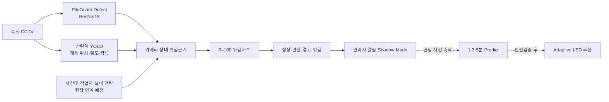

# PileGuard Adaptive 알고리즘 구현 및 분석

이 문서는 경진대회 제안서의 `3. 알고리즘 개발 > 알고리즘 구현 및 분석`에서
`추후 다시 작성`으로 남아 있는 부분을 교체하기 위한 본문이다. 수치는 저장소에
커밋된 결과 파일을 기준으로 2026년 8월 26일 정리했다.

## 1. 구현 범위와 검증 수준

PileGuard Adaptive는 공개데이터만으로 검증할 수 있는 기능과 실제 농장 사건영상이
필요한 기능을 분리해 구현했다.

| 구성요소 | 현재 상태 | 검증자료 | 현재 주장 가능한 범위 |
|---|---|---|---|
| PileGuard Detect | 구현·평가 완료 | MSU 공식 분할 | 정지영상 Piling/Non-piling 분류성능 |
| 개체·밀도·이동 특징 | 구현 완료 | NESTLER 6개 400-frame 작업 | 특징 추출과 결측 처리의 정상 작동 |
| 정지영상 밀도 특징 | 구현 완료 | PIO 공식 이미지·YOLO 라벨 1,487쌍 | 실제 육계사 정지영상의 밀도 특징 기능시험 |
| 국내 산란계 개체 검출 | 구현·평가 완료 | AI Hub 공식 Training·Validation | 국내 산란계 정지영상의 개체 위치·정적 밀도 검출 |
| 예측 박스 영상 위험지수 | 통합 기능시험 완료 | NESTLER 6개 영상, 2,392프레임 | 검출·공간·광류 특징과 상대 위험지수의 연결 |
| 카메라 상대 위험지수 | 구현 완료 | NESTLER 특징 | 이상징후 타임라인 기능시험 |
| Digital Twin 경보 | 구현 완료 | 문헌 기반 3개 합성 시나리오 | 위험곡선·경보 전환 로직 기능시험 |
| 1·3·5분 Predict | 미학습 | 국내 연속 사건영상 필요 | 목표와 평가절차만 정의 |
| Adaptive LED 정책 | 설계 단계 | 실제 개입·분산 사건로그 필요 | 초기 안전규칙과 고도화 계획만 정의 |



## 2. 정지영상 감지모델 구현 및 평가

### 2.1 모델과 학습조건

- 최종 적용 기준모델: ImageNet 사전학습 ResNet18, 2-class 분류 헤드
- 입력: MSU 원본 종횡비에 맞춘 중앙 Crop 후 672×295 Resize
- 색상: Grayscale 3채널 변환 후 ImageNet 평균·표준편차 정규화
- 학습 증강: 수평반전, 최대 5% 평행이동
- 손실함수: 학습 분할의 클래스 빈도를 반영한 weighted cross-entropy
- 최적화: SGD, learning rate 0.001, momentum 0.9, weight decay 0.0001
- 스케줄러: 7 epoch 이후 learning rate를 0.1배로 감소
- Batch size 16, 총 10 epoch, random seed 2026
- 최적모델 선택: Validation F1 기준 epoch 9 체크포인트

MSU가 제공한 Train 7,562장, Validation 853장, Test 2,848장의 공식 디렉터리를
그대로 유지했다. Test 결과를 보고 모델이나 임계값을 다시 조정하지 않았으며,
고정 임계값 0.5로 한 번 평가했다.

### 2.2 공식 Test 결과

| 지표 | 결과 |
|---|---:|
| Accuracy | 0.9810 |
| Precision | 0.9959 |
| Recall | 0.9616 |
| F1-score | 0.9785 |
| PR-AUC | 0.9984 |
| ROC-AUC | 0.9987 |
| Specificity | 0.9968 |
| 혼동행렬 | TN 1,567 / FP 5 / FN 49 / TP 1,227 |

전체 Test 평가에는 Apple MPS 환경에서 52.5초가 소요됐다. 이는 데이터 로딩을
포함한 평가 루프 기준 약 18.4 ms/image, 약 54.3 image/s이며, Edge 장치의
단일 프레임 지연시간으로 일반화하지 않는다.

### 2.3 오류 분석

오탐은 5건으로 Precision은 높았으나, 실제 Piling 49건을 Non-piling으로 분류했다.
특히 `ch16`에서 전체 FN 49건 중 29건(59.2%)이 발생했고 해당 채널 Recall은
0.6588이었다. 반면 다른 다수 카메라는 0.96 이상의 Recall을 보였다. 이는 전체
정확도만으로 현장 성능을 판단하면 카메라별 조명, 가림, 촬영각도 차이를 놓칠 수
있음을 보여준다. 현장 적용 전에는 농장·카메라별 성능을 분리해 확인하고, `ch16`과
유사한 저조도·부분가림 사례를 별도 수집해야 한다.

## 3. NESTLER 영상 특징 추출

주석과 대응되는 6개 400-frame 영상을 처리했다. 1개 영상은 실제 392프레임으로
종료되어 총 처리량은 2,392프레임이다. Bounding Box 주석이 있는 프레임은
2,309개이며, 결측 83프레임은 개체가 없는 정상 프레임으로 바꾸지 않고 결측으로
보존했다.

프레임마다 다음 특징을 계산했다.

- 개체수, 전체 Bounding Box 면적비
- 중심좌표 분산, 평균 최근접 개체거리
- 4×4 격자의 최대 개체 점유율
- Track ID 기반 평균 이동속도와 방향 일관성
- Farneback Optical Flow 평균·상위 90% 속도
- 광류 발산·수렴도와 방향 일관성

촬영환경별 평균 Bounding Box 면적비는 Bulgaria 0.0423, Rwanda 0.0142로 약
3배 차이가 났다. 따라서 모든 카메라에 하나의 절대 밀도 임계값을 적용하지 않고,
카메라별 초기 기준선 대비 변화량을 사용하도록 설계했다.

## 4. PIO 정지영상 밀도 특징 추출

PIO 공식 Train 1,035장과 Validation 452장 및 대응 YOLO 라벨을 전수 검사했다.
이미지·라벨 1,487쌍은 모두 일치했으며 원본 주석 327,288개 중 폭 또는 높이가
0인 5개를 제외한 327,283개 Bounding Box를 처리했다. 프레임 경계를 넘는
2,889개 박스는 이미지 영역으로 잘라 면적을 계산했다.

이미지별로 개체수, 잘린 Bounding Box 면적합, 중심좌표 분산, 평균 최근접거리,
4×4 격자의 최대 개체수와 점유율을 계산했다. 이미지당 유효 개체수는 평균 220.1,
중앙값 179, 95백분위 558.1, 최대 1,151개였다. 상용형 환경 1,005장과 프로토타입
환경 463장의 평균 개체수는 각각 291.4개와 61.6개로 촬영환경 차이가 컸다.

PIO는 해외 육계 데이터이며 Piling 사건 라벨과 시간 연속성이 없다. 따라서 이
결과는 실제 축사 정지영상에서 밀도 특징 계산이 작동한다는 기능시험으로만 사용하고,
국내 산란계의 밀도분포·사고 발생확률·1·3·5분 예측성능 근거로 사용하지 않는다.

## 5. AI Hub 국내 산란계 개체 검출

AI Hub 데이터셋 575의 공식 Training 36,423장과 Validation 4,546장을 전수
검사했다. SHA-256 기준 Training–Validation 중복 이미지 180개 그룹과 분할 내부
중복 이미지 703개를 확인했으며, 동일 이미지가 양쪽 분할에 남지 않도록 Validation을
우선 보존했다. 중복 Bounding Box 533개와 면적이 0인 Box 2개도 학습 대상에서
제외해 최종 Training 35,548장, Validation 4,538장으로 학습용 목록을 구성했다.

PIO에서 학습한 YOLO26n 가중치를 초기값으로 사용하고 random seed 2026, 입력
480px, batch size 16, Apple MPS 환경에서 1 epoch 미세조정했다. 중복 제거 후
Validation 4,538장의 학습 로그 기준 Precision 0.7736, Recall 0.7048, mAP50 0.8017,
mAP50–95 0.5136이었다. 이 Validation은 체크포인트와 임계값 선택에도 사용했으므로
독립 Test나 외부농장 일반화 성능으로 부르지 않는다.

동일한 원본 Validation 4,546장에서 PIO 초기모델과 미세조정 모델을 confidence
0.25로 비교했다. 중심점 매칭 F1은 0.2808에서 0.7450, IoU 매칭 F1은
0.0234에서 0.7293으로 증가했고 개체수 MAE는 17.45에서 5.75로 감소했다.
별도 임계값 오류 분석에서 위치검출 F1 최적값은 confidence 0.20의 0.7467이었고,
개체수 MAE 최적값은 confidence 0.25의 5.75로 목적별 최적점이 달랐다.

confidence 0.20에서 산란 초기의 중심점 F1은 0.6265였고 이미지의 81.8%에서
과소계수했지만, 중기와 후기 F1은 각각 0.7857과 0.7873이고 개체수 편향은
각각 +4.82와 +5.17이었다. 따라서 원시 예측 개체수를 농장 밀도로 직접 사용하지
않고 산란단계·농장·카메라별 교정값을 적용해야 한다. AI Hub 자료는 정지영상
개체 Box를 제공하지만 연속 Piling·압사 사건시각은 제공하지 않으므로 이 결과도
1·3·5분 전조예측 성능은 아니다.

## 6. 예측 Bounding Box 기반 영상 위험 파이프라인

AI Hub 미세조정 모델의 예측 Bounding Box에서 개체수, 면적비, 중심분산,
최근접거리와 격자 집중도를 계산하고 NESTLER 영상의 Optical Flow 특징과 결합했다.
NESTLER에는 예측 Box의 Track ID가 없으므로 추적 기반 속도·방향 특징은 결측으로
보존했고, 사용 가능한 위험근거가 4종 미만이면 정상으로 대체하지 않고
`unavailable`로 처리하도록 했다.

공식 NESTLER 6개 영상 2,392프레임 전부에서 검출 결과가 생성됐고, 60프레임
카메라 교정구간 이후 위험근거 가용률은 100%였다. Apple MPS 기능시험 처리량은
약 45–51 FPS였으나 데이터 로딩과 장치 조건이 다른 Edge 배포속도로 일반화하지
않는다. `job_000007`에서 경고단계가 4프레임 발생했지만 NESTLER에는 공식 사건
정답이 없으므로 이를 사고 적중, 오경보 또는 선행시간으로 해석하지 않는다.

## 7. 카메라 상대 위험지수 통합 데모

각 영상의 초기 60프레임에서 특징별 median과 IQR을 계산한 뒤 이후 값을 0–1
범위의 상대 변화량으로 변환했다. 영상별 FPS가 약 18.8–25.4이므로 이 교정구간은
약 2.4–3.2초다. 실제 배포에서는 농장주가 정상으로 확인한 더 긴 기간으로 교체한다.

| 위험근거 | 현재 계산 방식 |
|---|---|
| 밀도 | Bounding Box 면적비의 기준선 대비 증가 |
| 유입 대리값 | 개체수 증가와 추적·광류 속도 증가의 결합 |
| 근접도 | 평균 최근접거리의 기준선 대비 감소 |
| 수렴도 | Optical Flow 수렴도의 증가 |
| 방향 일관성 | Track/Optical Flow coherence 증가 |
| 국소 집중도 | 최대 격자 점유율 증가 |
| 외부 맥락 | NESTLER에 작업자·문 정보가 없어 0으로 고정 |

위험지수는 세 가지 문헌 기반 기전 점수 중 최댓값에 100을 곱한 데모 지수다.
EWMA로 평활화한 뒤 40/60/80을 관찰/경고/위험 기준으로 사용하며, 단계가 내려갈
때 5점의 hysteresis를 적용해 경보 깜빡임을 줄였다. 이는 사건 발생확률이 아니며
현장사건으로 교정된 임계값도 아니다.

6개 영상 2,392프레임의 통합 실행에서 교정구간 이후 위험근거를 계산할 수 있었던
프레임 비율은 95.8%였다. 특징이 4종 미만인 프레임은 정상으로 간주하지 않고
`unavailable`로 출력했다. `job_000007`은 위험단계까지 상승했지만 NESTLER에는
Piling 정답이 없으므로 이를 사고 적중, Recall 또는 오경보로 해석하지 않는다.

NESTLER 영상 길이는 약 15.8–21.3초이므로 제안서에서 목표로 한 30초 시계열 및
1·3·5분 선행예측을 평가하기에 부족하다. 현재 결과는 특징·정규화·경보 파이프라인의
기능시험이며, 선행예측 성능은 국내 연속 사건영상 확보 후 별도로 검증한다.

## 8. Digital Twin 기능시험

문헌에 기술된 사건 형성과정을 바탕으로 사회적 유인형, 집단이동 수렴형,
직원 추종·관측외형의 세 가지 180초 합성 시나리오를 생성했다. 동일한 위험지수와
경보 코드를 적용한 결과는 다음과 같다.

| 합성 시나리오 | 최대 위험지수 | 관찰 | 경고 | 위험 |
|---|---:|---:|---:|---:|
| 사회적 유인형 | 93.76 | 79초 | 95초 | 115초 |
| 집단이동 수렴형 | 88.33 | 71초 | 87초 | 111초 |
| 직원 추종·관측외형 | 91.20 | 47초 | 89초 | 122초 |

이 시간은 실제 농장의 선행시간이나 예측성능이 아니라, 정해진 입력 궤적에서 경보가
순서대로 전환되는지 확인하기 위한 합성 시간이다. 해외 연구의 사건 분류비율도
국내 발생확률로 사용하지 않았다.

## 9. 재현성과 테스트

모든 단계는 Git으로 버전관리하고 설정값을 TOML 파일로 분리했다. 원본 데이터와
학습 가중치는 저장소에 포함하지 않으며 사용자가 외부 데이터 경로를 지정한다.

```bash
export PILEGUARD_DATA_ROOT="../data"

# 데이터 구성 확인
pileguard-check-data

# MSU 학습·공식 Test 평가
pileguard-train-msu --config configs/msu_resnet18.toml --device auto
pileguard-evaluate-msu --checkpoint weights/msu-resnet18/best.pt --device auto

# NESTLER·PIO 특징, 합성 시나리오, 통합 데모
pileguard-extract-nestler --data-root ../data
pileguard-extract-pio --data-root ../data
pileguard-simulate-risk
pileguard-run-demo

# 영상 특징 추출부터 위험 타임라인까지 한 번에 실행
pileguard-run-demo --extract --data-root ../data

# AI Hub 산란계 검출 결과와 광류를 결합한 영상 위험 기능시험
pileguard-run-video-risk --videos <video.mp4> --device auto
```

최종 `main` 기준 editable 설치와 wheel 빌드를 확인했고, 22개 CLI 진입점의
`--help` 실행과 단위·통합 테스트 81개가 통과한다. 테스트 범위에는 데이터 분할
탐색·전처리, NESTLER 공간·추적·광류 특징, PIO와 AI Hub 이미지·라벨 품질검사,
YOLO 박스 경계·중복·분할 누수 처리, 위험점수 경계, 경보 hysteresis, 합성
시나리오, 카메라 기준선, 교정구간 경보 억제와 결측 위험값 차단이 포함된다.

추적 파일 176개를 별도로 감사한 결과 원본 데이터, 모델 가중치, 영상·압축파일,
`.env`나 토큰, 개인 로컬 절대경로가 포함되지 않았다. `weights/`와 `outputs/`는
`.gitignore`에 등록돼 있으며 실험 산출물에는 재현에 필요한 요약 통계와 그래프만
보관한다.

## 10. 현장 실증과 고도화 계획

다음 단계에서는 Piling 발생 최소 5분 전부터 완전 분산 후까지의 연속영상을
사건 단위로 수집한다. 초기 권장량은 Piling 사건 20건 이상과 동일 시간대의
Non-piling 대조구간이며, 조명·급이·환기·작업자 출입과 수동 또는 LED 개입시각을
함께 기록한다.

초기에는 경보를 전송하지 않는 Shadow Mode로 사건 Recall, 카메라당 일일 오경보,
평균·중앙 선행시간과 카메라별 편차를 측정한다. 데이터가 확보된 후 1·3·5분 목표의
LightGBM baseline과 TCN을 비교한다. LED 자동제어는 농장주 승인과 안전검증 이후에만
검토하며, 그전에는 관리자 알림과 수동 승인방식을 유지한다.

## 11. 결과 근거 파일

- MSU 학습: `artifacts/msu-resnet18/training_history.json`
- MSU Test: `artifacts/msu-resnet18/test/metrics.json`
- NESTLER 특징: `artifacts/nestler-features/summary.json`
- PIO 정적 밀도 특징: `artifacts/pio-features/summary.json`
- PIO 이미지별 특징: `artifacts/pio-features/image_features.csv`
- AI Hub 데이터 품질·중복 감사: `artifacts/aihub-laying-hen-dataset/summary.json`
- AI Hub 산란계 학습: `artifacts/aihub-laying-hen-yolo26n/training_summary.json`
- AI Hub 전체 Validation: `artifacts/aihub-laying-hen-yolo26n/validation/summary.json`
- AI Hub 단계별 오류·임계값 감사: `artifacts/aihub-laying-hen-yolo26n/error-audit/summary.json`
- 예측 Box 영상 위험 기능시험: `artifacts/aihub-video-risk/summary.json`
- 예측 Box 위험 타임라인: `artifacts/aihub-video-risk/risk_timelines.png`
- Digital Twin: `artifacts/digital-twin/scenario_summary.json`
- 통합 데모: `artifacts/integrated-demo/summary.json`
- 위험 타임라인: `artifacts/integrated-demo/risk_timelines.png`

## 12. 공개데이터 출처

- MSU Poultry Piling Dataset, CC BY 4.0,
  DOI `10.17632/pgp8mj6ms4.2`
- NESTLER Poultry Behaviour Analytics Detection Dataset, CC BY 4.0,
  DOI `10.5281/zenodo.20924893`
- PIO: A Dataset for Multiple Poultry Tracking, CC BY 4.0,
  DOI `10.5281/zenodo.16686320`
- AI Hub 지능형 스마트 축사 데이터(육계, 산란계), 데이터셋 575,
  `https://www.aihub.or.kr/aihubdata/data/view.do?dataSetSn=575`

Digital Twin 구성에 사용한 Gray et al.(2020), Winter et al.(2022)의 전체
서지정보는 기존 제안서의 `[별첨] 자료출처`와 동일하게 유지한다. 제출본에서는
저자·연도만 남기지 말고 기존 참고문헌 전체 항목과 함께 제시한다.
